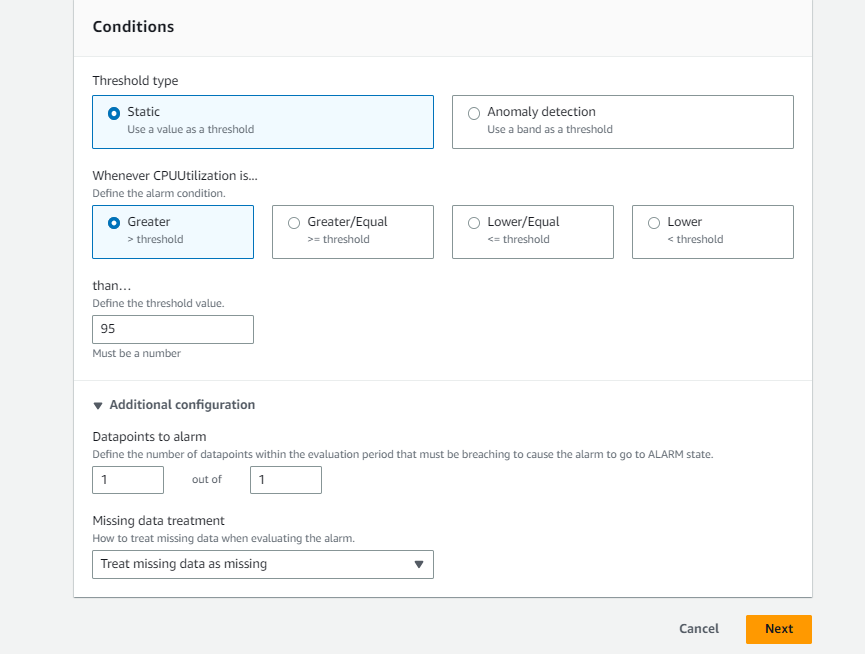
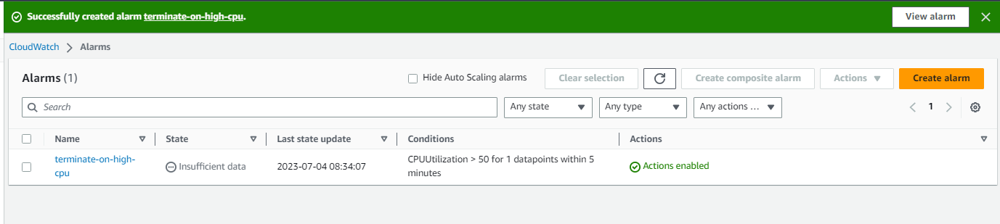

Project Description: Creating a cloud-watch alarm to terminate/autoscale the ec2 instance when the resource utilization exceeds a certain threshold

Problem statement: I have my application running on ec2 instances but the cpu utlization of a particular instances exceeds 95% and stays the same for 15 minutes, in that case i would want to get rid of that instance.

Section 1: Create a EC2 instance

Section 2: Creating a cloudwatch alarm

1. In the AWS Management console, search for cloudwatch and after landing on the console, in the left navigation pane click on alarms.
2. under cloudwatch > alarm, click on orange create alarm button
3. click on select metric, a new window will appear scroll down and  under browser search for ec2 and click on it and then select per-Instance Metrics
4. Once you select Per-Instance Metrics a list of metrics will be displayed, choose the one you want to create your filter on and click select metric.
5. You'll now come back to the specify metrcs and conditions page, under metrics section select the statistics(in this case maximum) and period(how often you want to monitor the instance) as per your choice
6. under conditions section, select threshold type and static, cpu utlization (greater>threshold) and define the threshold value like this.
   
8. Under additional configuration, select the data point as 1 out of 1, that means if for 5 minutes the instance's cpu utilization is 95%, terminate the instance
9. Next move to configure actions, under ec2 action select In alarm and select terminate the instance that means when the alarm is in action based on our threshold the instance will be terminated
10. We are on the last stage now, Add a suitable name for the alarm click on next review everything and click create alarm.
    

Our Alarm is now ready and monitor the CPU utilization!!!   

